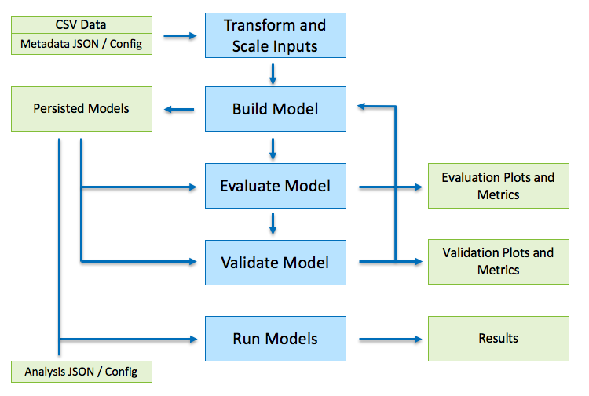

Getting Started
***************

.. toctree::

The ROM Framework is designed to help users build, evaluate, validate, and run reduced order models.
The image below shows the typical workflow and the required data. Each of the blue boxes
represent a process and the green boxes represent either an input dataset or a output data.

In order to run the build method, the user must supply the data in CSV format with an accompanying
JSON file which describes a) the build options, b) the response variables, and c) the covariates.
An explanation and example of how the metadata JSON config file looks is shown in
:doc:`example metadata json file <metadata_json_ex>`.

The four main functions of this file include:

1) Build

    Use the build positional argument to build a new reduced order model as defined in the
    metamodels.json file. There are several arguments that can be passed with the build command
    including:

    .. code-block:: bash

        ./rom-runner.py run -a smoff_parametric_sweep -m RandomForest -ad examples/smoff-one-year.json -w examples/lib/USA_CO_Golden-NREL.724666_TMY3.epw -d 0.15 -o output.csv

